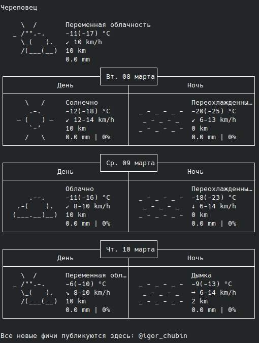

# Прогноз погоды в терминале.

Скрипт позволяет получить погоду от сервиса https://wttr.in/.

**Подготовка Linux:**<br>

Скачать git:
```
sudo apt-get install git
```
Сделать fork репозитория:
```
git clone https://github.com/NankuF/dvmn_api_web_service.git
```
Перейти в директорию со скриптом:
```
cd ~ && cd dvmn_api_web_service/
```
Создать виртуальное окружение:
```
python -m venv venv
```
Активировать виртуальное окружение:
```
. ./venv/bin/activate
```
Установить зависимости:
```
pip install -r requirements.txt 
```
**Запуск:** <br>

Ввести в консоли код:
```python
python api_weather.py
```

Пример: <br>


Документация:
https://wttr.in/:help